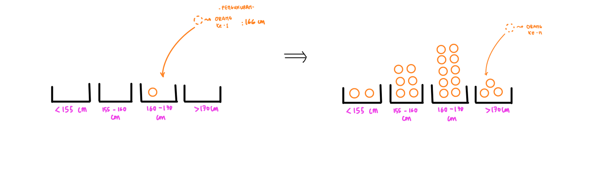

# Probability Series (Part-1)

Halo. Pada tulisan saya kali ini, saya akan berbagi mengenai beberapa catatan saya terkait konsep-konsep penting di topik *probability* terutama yang berkaitan erat dengan *deep learning*. 

The main reason i'm blogging this is simple. I came across the Deep Unsupervised Learning course, conducted by Pieter Abbeel team, and in the first lecture, I got intimidated by this scary math notation wkwkwk.

 

Dari cuplikan *lecture* di atas, ada beberapa konsep yang penting untuk dipahami: 
* *Probability Distribution*
* *Expectation*
* *Maximum Likelihood*
* *KL Divergence*

Pada post kali ini, kita akan membahas tentang *Probability Distribution*

## Probability Distribution - The main Idea

Bayangkan ketika kita mengukur tinggi badan banyak orang. Proses pengukuran ini bisa kita visualisasikan sebagai berikut.

